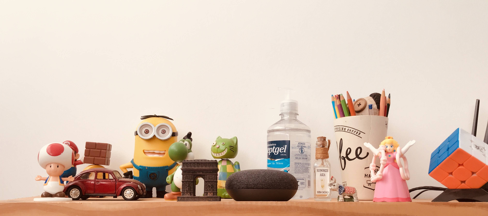

Hey all! Thanks for reading my first non-work related post in this blog. I mean in this blog because now that I think about it I realize that I used to write a lot about personal stuff when I was a teenager and even though most of that writting got lost on many branches I took while growing up, I still have this urge to take notes or register any thoughts or ideas I might randomly have. It is sad I don't usually end up doing that in an "official" way. I usually just use paper or throw them in Google Keep and never look at them again. Then after some time you look at them and they just won't make sense.

[Listening to Corinne by Metronomy]

I guess the same thing happened in the past where I would register things that came into my mind and then they would get lost midst all papers and notes about tests, homeworks, assignments, projects, etc. It almost feels like there is never free time for "unrelevant" notes. Routine just takes care of making sure those things do not see the light of day and keeping them in sort of a limbo.

Anyways, I've been thinking about publishing something more personal for a while now but just couldn't find a more specific theme to write about considering that there are so many thoughts going through my head and so many ideas that could go well together in a single post but could also have their own post. All of that makes it hard for you to come up with something that is good enough to share, like something that might make sense to someone else reading it instead of being seen as just something too personal that just serves the purpose of getting a felling off of my chest.

So here we are, reading and writing about mind, Body, and Work, altogheter with the purpose of encompassing a bunch of annotations I made and was able to gather from the past few months. As I mentioned, those are themes that could easily go into individual posts and there would be just so much to talk about but they kind of make sense together considering that those three things in my opinion, and most people might think alike, are sort of a threefold that keeps life going and the way you handle each of of them will define whether life will be going great, bearable or just real bad.

[Listening to How Deep Is Your Love by Bee Gees]

Work
When using the word work in this entire post, I am not referring only to professional life or work you do as an adult. The aspect of work mentioned is a lot more broad, referring to anything that might sound like a chore and that, even though you see as comfortably necessary or feel like you're passionate about, it is still sort of imposed on you by the standards you live in or by society. Since the moment you're born you start getting tons of expectations and chores that queue up as you grow up and most of the time you are not even aware that they are in there and that they have a purpose. You just sort of nod your head to everything and keep going, and if you're lucky you'll be able to get glimpses of clarity at a few points, which might make you change branches you take in life.

School, college, internship, then engage with a full time job, throw in some achievements in there, side projects, meetings, presentations... It all looks so much predefined as if someone else that came before you is giving you this as a gift so you won't have to do the work of figuring out how life works and possibly not making the same mistakes they did. Of course that's not entirely strict and does not represent a "Golden Path" to success in reality but it does feel like a standard for most people. There are so many other ways in which that pattern can be imposed upon us that sometimes is hard to see that after all we're just walking towards the same goal but simply taking different branches of the aforementioned path.

All this talk about work and how it pressures and at the same time might grants us some praise comes with its own concerns and wonderings. I am trully not entirely against what has been established by others. I am definetely not someone that can serve as an example of going against that, it is quite the opposite. However, that does not force us, those who play by the "rules", to remain outside of the debate. In fact, there are tons of intriguing thoughts that might only come to you when you experience things. I mean, how far are we planning on going with achievements that might come out of all this Work? Are we constantly turning things that were supposed to bring us joy into chores? Are we just replicating what others before us have done and not really aggregating into some bigger plan?

Well, feel free to go get answers somewhere or come up with your own. I'm not here to answer these, I never said I was, sorry.

[Listening to I Feel Love by Donna Summer]

Body
When talking about body one might think "Here it comes the talk about aesthetics". Well, that's totally expected since body and aesthetics are usually put together and sometimes even as one being a consequence of the other. The thing is that when you focus too much on aesthetics there is an entire new discussion involved which is how you perceive beauty standards, which have changed and will continue to change as time goes by. For this post, that's totally not the focus so I wanted to make this clear.

I consider body being one important thing to talk about when aiming at discussing life or just health in general because the current state of our body and how we relate with it weights a lot in the equation that gives us an insight on how our life is going and will go for a while.

I guess knowing your body well and understanding what it wants and how it wants to change at specific moments in your life is way too important to just ignore it and leave it out of the equation. When we're young and decided to thrive through a career, it's easy to ignore that and focus on other aspects of life since it always seem like our body can wait, it can hold, it can adapt. Well, that's not entirely wrong. In fact, there are so many other new things and so many things we have to achieve in such a short period of time that we prefer to go with things that will provide us with more glory, I would say. That kind of motivates us and this motivation reflects in how our body behaves and responds to a certain routine or changes of routine.

The most interesting thing now is: everyone seems to be aware of those things! I feel like this is somehow a self-harming situation where everyone's okay with. And because of that it becomes so hard to draw a line between what we can go for and what we have to give up on. Your body might even draw that line for you down the road if you don't care about doing that yourself, but unfortunately the line it'll draw it will already be behind you...

From personal experience I see the importance of constantly taking some time to just stop and try to understand the current relation you have with your Body, then taking some action, which could either be taking steps back and prioritize your body health or just keep going if you see there's nothing to worry about, maybe you do have a more resistant body then others :)

[Listening to Reverie by Arca]

Mind
Finally, and definetely not less important, we arrive at mind. I can't even begin to talk about mind because I myself never got a handle on it, even though sometimes I felt like I did it turns out it is a lot more complicated than I thought to make it last long enough. So ya, still a work in progress.

In my opinion, a good long-lasting state of mind is not something achievable in a quick manner and even when it feels like you have that, you end up noticing that there are so many things that can easily take that away from you that you realize this actually needs to be a continuous process of health checks at a consistent level. Just the fact that it requires so much effort it's already enough motive to bring you down. Mind can be such a fragile thing if you don't know how to handle the many hits you might take in life.

I am usually seen as someone who criticizes therapy a lot. It is sort of a conflicting scenario where I totally understand the need for it and how it can change you if it is done right. The thing is, unless you are willing to let someone help you, there is no point in doing therapy, it will just be a waste of time and money. It is something that you can not be forced to do. If you are like me, the first thing you need to work on, which is definetely not easy or quick, is to recognize that there are professionals that can match your expectations and then finding the time (and most of the time, money) to experiment until you're comfortable.

Regarding mind, this might not be the best post to read if you're looking for answers, as mentioned there is a lot of "getting stuff off of my chest" in this post. However, if you feel like this section relates to you, I hope that the fact that we think alike might have helped somehow.

Mind . Body . Work

Hopefully you've come to the conclusion of this post by yourself. It makes sense though to reiterate that mind, body and work are things that need balancing and finding that is one of the hardest chalenges we have in life, mainly because most of the experiences we go through in life almost always require that you give up on one to focus on the other. That is completely fine and it does not make sense to go against that. Instead of trying to avoid having to make these decisions you'd rather be better off learning how to quickly get back on track after you handle things or at least get back to a central point where you can take a moment to look at those three things and understand how each one is going. Just being aware of that is enough to get started on improving life in variuos aspects.

Well, thanks for reading and I hope you're back on my next post, that being tech related or not :)
